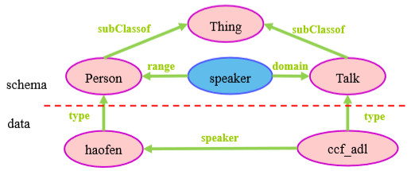

# 知识表示和知识建模
---

知识图谱的发展历程

**语义网络(1960)->本体论(1980)->Web(1989)->语义网(1998)->链接数据(2006)->知识图谱(2012)**

## 1 基于语言网的知识表示框架

### 1.1 RDF和RDFS

**RDF ： Resource Description Framework 资源描述框架, 是数据模型**

RDF 含义:

- Resource: 页面, 图片, 视频等任何具有URI标识符的内容
- Description: 属性, 特征和资源之间的关系
- Framework: 模型, 语言和这些描述的语法

RDF 三元组模型

- 主(subject)
- 谓(predicate)
- 宾(object)

**RDF在线验证器: http://www.w3.org/RDF/Validator/**

**RDFS: RDF Schema**

RDFS 为 RDF 定义了如下词汇:

- Class
- subClassOf
- type
- Property
- subPropertyOf
- Domain
- Range

### 1.2 OWL和OWL2 Fragments

### 1.3 SPARQL查询语言

### 1.4 Json-LD、RDFa、HTML5 MicroData等新型知识表示

## 2 典型知识库项目的知识表示

## 3 基于本体工具（Protege）的知识建模实践

