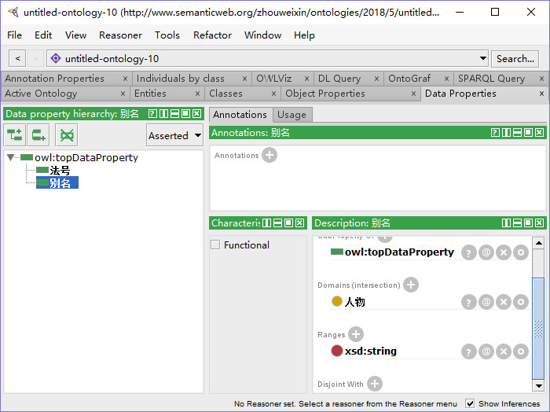
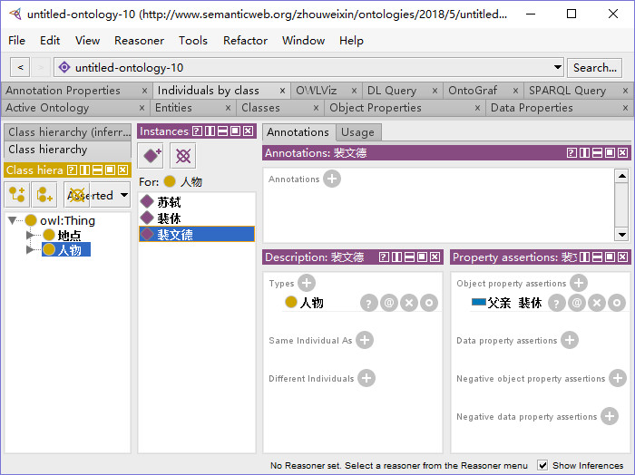

# 本体构建工具protege的使用
---

## 使用protege构建如下关系：


## 相关概念

- 类: class
- 子类: subClass
- 对象属性: object property
- 数据属性: data property
- 实例: individual

## 步骤

### 0 新建本体

- 新建本体, 得到下图:

```
File -> New
```


### 1 创建模式层
#### 1.1 创建类

- 创建[地点]类

```
classes -> owl:Thing -> 右键 -> Add Subclasses -> 输入地点 -> 确定
```

- 同理创建[人物]类, 结果如下图:


#### 1.2 创建子类

- 创建[地点]类的子类[寺庙]

```
classes -> 地点 -> 右键 -> Add Subclasses -> 输入寺庙 -> 确定
```

- 同理创建[学校],[男人],[禅师]类, 结果如下图:


#### 1.3 创建对象属性

- 创建对象属性[开山始祖]

```
Object Properties -> owl:topObjectProperty -> 右键 -> Add Sub-properties -> 输入开山始祖 -> continue -> finish
```

- 同理创建对象属性[前身], [曾住], [法号], [相识], [别名], [父亲], 结果如下图:


#### 1.4 关联类与对象属性

- 关联[地点]的[开山始祖]是[人物]

```
Object Properties -> 开山始祖 -> Decription:开山始祖 -> Domains(intersection) 加号 -> 选择地点 -> 确定;

Object Properties -> 开山始祖 -> Decription:开山始祖 -> Ranges(intersection) 加号 -> 选择人物 -> 确定;
```

- 同理关联其它, 结果如下图:


#### 1.5 创建数据属性

- 创建数据属性[别名]

```
Data Properties -> owl:topDataProperty -> 右键 -> Add Sub-properties -> 输入开山始祖 -> continue -> finish
```

- 同理创建[法号], 结果如下图:


#### 1.6 关联类与数据属性

- 关联[人物]的[别名]类型为[string]

```
Date Properties -> 别名 -> Decription:别名 -> Domains(intersection) 加号 -> 选择人物 -> 确定;

Date Properties -> 别名 -> Decription:别名 -> Ranges 加号 -> Built in datatypes -> 选择xsd:string -> 确定;
```

- 同理关联法号, 结果如下图:



#### 1.7 设置[人物]和[地点]不相交

```
Classes -> 地点 -> 右键 -> Description: 地点 -> Disjoint With 加号 -> 选择人物 -> 确定
```


#### 1.8 查看模式层结构图

```
OntoGraf -> 双击加号展开 -> 选择Spring布局
```


### 2 创建实例层
#### 2.1 创建实例

- 创建实例[裴休]

```
Individuals by class -> Class hierarchy 选择人物 -> Instances 点击紫色+ -> 输入裴休 -> 确定
```

- 同理创建实例[裴文德], [苏轼], [佛印禅师], [镇江金山寺], [晋朝泽心寺], 结果如下图:


#### 2.2 设置对象属性

- 设置[裴文德]的[父亲]为[裴休]

```
Individuals by class -> Class hierarchy 选择人物 -> Instances 选择裴文德 -> Property assertions: 裴文德 -> Object property assertions 加号 -> 左边输入父亲 -> 右边输入裴休 -> 确定
```

- 同理设置[开山之祖], [前身], [相识], [曾住], 结果如下图:



#### 2.3 设置数据属性

- 设置[裴文德]的[法号]为[法海]

```
Individuals by class -> Class hierarchy 选择人物 -> Instances 选择裴文德 -> Property assertions: 裴文德 -> Data property assertions 加号 -> 左边选择法号 -> 右边输入法海 -> 确定
```

- 同理设置[苏轼]的[别名]为[苏东坡、苏坡], 结果如下图:


### 2.4 查看图


