# sparql 语法学习
---

## 1. 安装apache-jena-fuseki-3.7.0

### 1.1 下载

进入[官网](http://jena.apache.org/download/index.cgi)下载apache-jena-fuseki-3.7.0.zip, 如下图所示

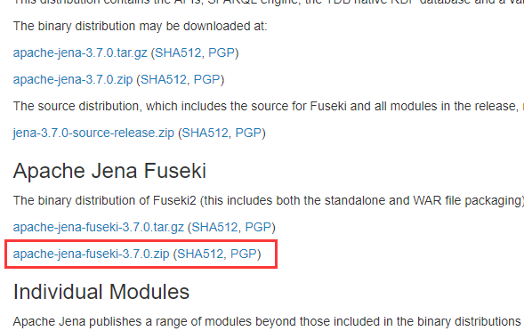

### 1.2 解压

打工目录如下图

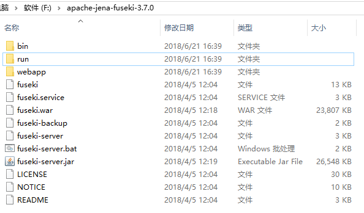

### 1.3 运行

双击fuseki-server.bat启动服务器

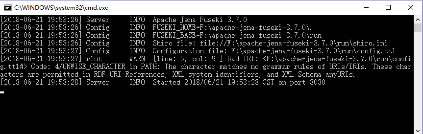

打开浏览器输入http://localhost:3030访问

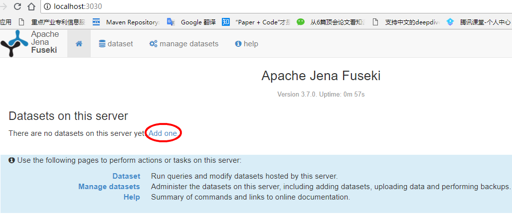

### 1.4 创建数据集

点击如上图所示的Add one或者如下图所示添加数据集, 名为test

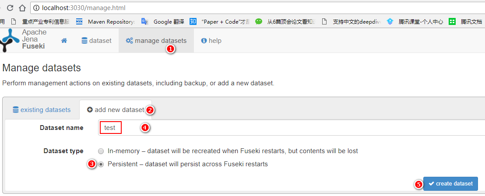

## 2. 导入数据

### 2.1 创建RDF三元组文件: data1.nt

注: 三元组最后有一个 **"."**

data1.nt

```nt
<http://zhou.org/西游记/孙悟空> <http://zhou.org/名号> "齐天大圣" .
<http://zhou.org/西游记/通臂猿猴> <http://zhou.org/名号> "超天大圣" .
```

### 2.2 导入文件

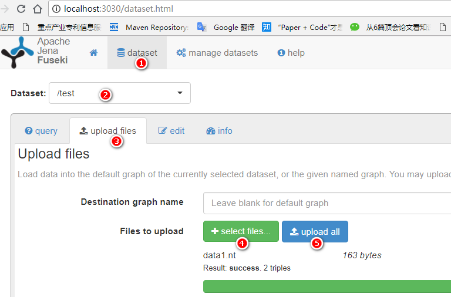

## 3. 查询命令

### 3.1 查询所有三元组

**查询语句:**
```sparql
select ?s ?p ?o
where{
	?s ?p ?o
}
```

**说明:**
- ?s, ?p, ?o表示变量, 查询语句里的变量都是以?开头
- ?s, ?p, ?o里的s, p, o表示的是变量名, 任何字母都可以
- select 后的?s, ?p, ?o无法确定表示什么含义, where里面的?s, ?p, ?o按顺序分别表示主, 谓, 宾, 使select后面的变量确定了含义
- where的语句要用{}包围
- where语句里内容表示的是匹配的含义, 此处全为变量, 表示匹配所有

**查询结果:**

```
{
  "head": {
    "vars": [ "s" , "p" , "o" ]
  } ,
  "results": {
    "bindings": [
      {
        "s": { "type": "uri" , "value": "http://zhou.org/西游记/孙悟空" } ,
        "p": { "type": "uri" , "value": "http://zhou.org/名号" } ,
        "o": { "type": "literal" , "value": "齐天大圣" }
      } ,
      {
        "s": { "type": "uri" , "value": "http://zhou.org/西游记/通臂猿猴" } ,
        "p": { "type": "uri" , "value": "http://zhou.org/名号" } ,
        "o": { "type": "literal" , "value": "超天大圣" }
      }
    ]
  }
}
```

**过程如下图:**

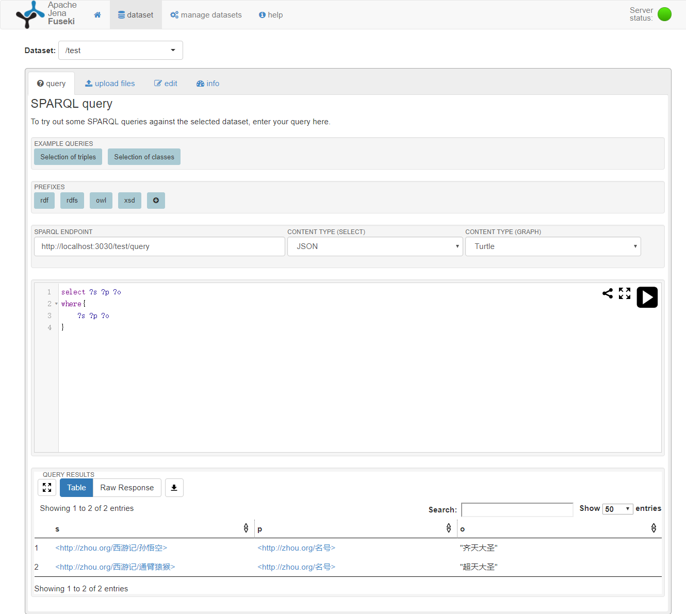

### 3.2 查询孙悟空的名号

**查询语句**
```sparql
select ?名号
where{
	<http://zhou.org/西游记/孙悟空> <http://zhou.org/名号> ?名号
}
```

**结果**

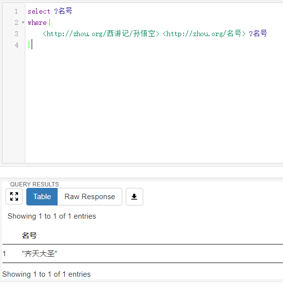

### 3.3 查询所有的名号

**查询语句**
```sparql
select ?名号
where{
	?s <http://zhou.org/名号> ?名号
}
```

**结果**

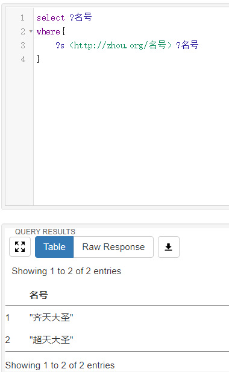

### 3.4 带前缀的查询

**查询语句**
```
PREFIX 西游记: <http://zhou.org/西游记/>

select ?名号
where{
	西游记:通臂猿猴 ?p ?名号
}
```

**结果**

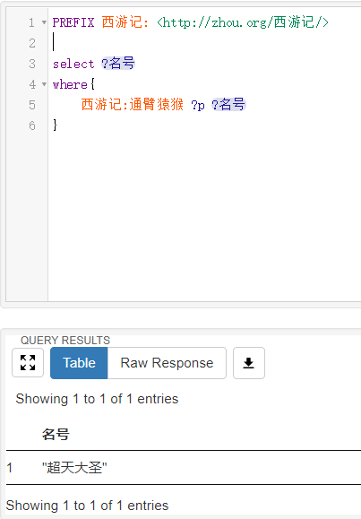

## 4. 进阶实战

### 4.1 RDF数据

**data2.rdf**

```xml
<rdf:RDF
  xmlns:rdf='http://www.w3.org/1999/02/22-rdf-syntax-ns#'
  xmlns:vCard='http://www.w3.org/2001/vcard-rdf/3.0#'
   >

  <rdf:Description rdf:about="http://somewhere/JohnSmith/">
    <vCard:FN>John Smith</vCard:FN>
    <vCard:N rdf:parseType="Resource">
      <vCard:Family>Smith</vCard:Family>
      <vCard:Given>John</vCard:Given>
    </vCard:N>
  </rdf:Description>

  <rdf:Description rdf:about="http://somewhere/RebeccaSmith/">
    <vCard:FN>Becky Smith</vCard:FN>
    <vCard:N rdf:parseType="Resource">
      <vCard:Family>Smith</vCard:Family>
      <vCard:Given>Rebecca</vCard:Given>
    </vCard:N>
  </rdf:Description>

  <rdf:Description rdf:about="http://somewhere/SarahJones/">
    <vCard:FN>Sarah Jones</vCard:FN>
    <vCard:N rdf:parseType="Resource">
      <vCard:Family>Jones</vCard:Family>
      <vCard:Given>Sarah</vCard:Given>
    </vCard:N>
  </rdf:Description>

  <rdf:Description rdf:about="http://somewhere/MattJones/">
    <vCard:FN>Matt Jones</vCard:FN>
    <vCard:N
      vCard:Family="Jones"
      vCard:Given="Matthew"/>
  </rdf:Description>

</rdf:RDF>

```

**RDF图如下所示:**

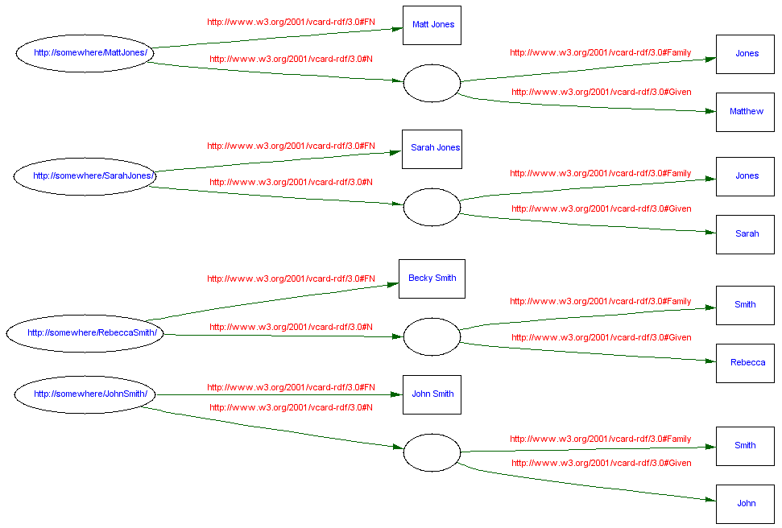

### 4.2 导入jena数据库

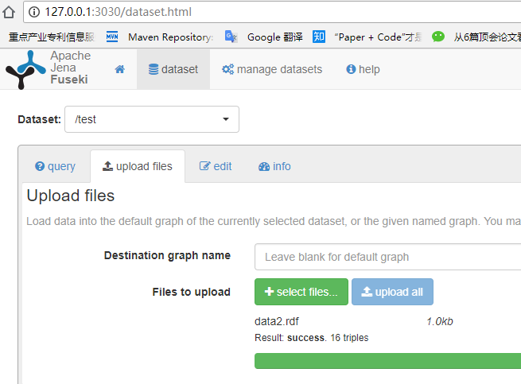

### 4.3 Basic Patterns

**1.查询语句**
```sparql
SELECT ?x
WHERE { 
  ?x  <http://www.w3.org/2001/vcard-rdf/3.0#FN>  "John Smith" 
}
```

**结果**
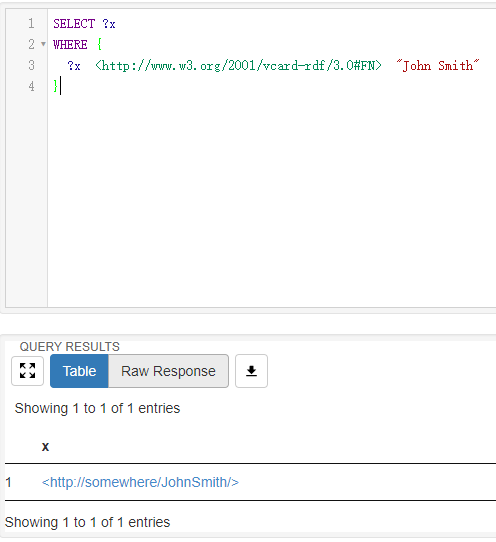

**2.查询语句**
```sparql
SELECT ?x ?fname
WHERE {
  ?x  <http://www.w3.org/2001/vcard-rdf/3.0#FN>  ?fname
}
```

**结果**


**3.查询语句**
```sparql
SELECT ?givenName
WHERE{ 
  ?y  <http://www.w3.org/2001/vcard-rdf/3.0#Family>  "Smith" .
  ?y  <http://www.w3.org/2001/vcard-rdf/3.0#Given>  ?givenName .
}
```

**结果**
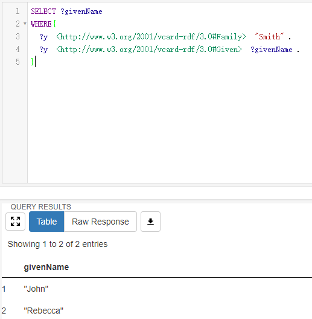

### 4.4 Filters

**正则表达式过滤:** *字母不区分大小写*
匹配包含:r, R, i, I的名称
```sparql
PREFIX vcard: <http://www.w3.org/2001/vcard-rdf/3.0#>

SELECT ?g
WHERE{ 
  ?y vcard:Given ?g .
  FILTER regex(?g, "r", "i") 
}
```

**结果**
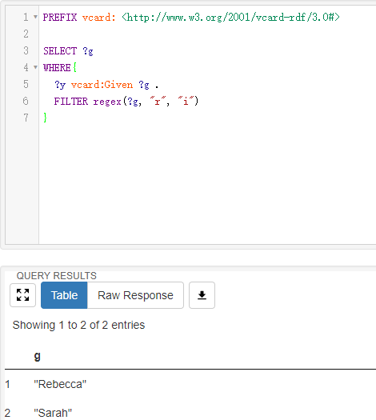

*导入新的data/data3.rdf数据*

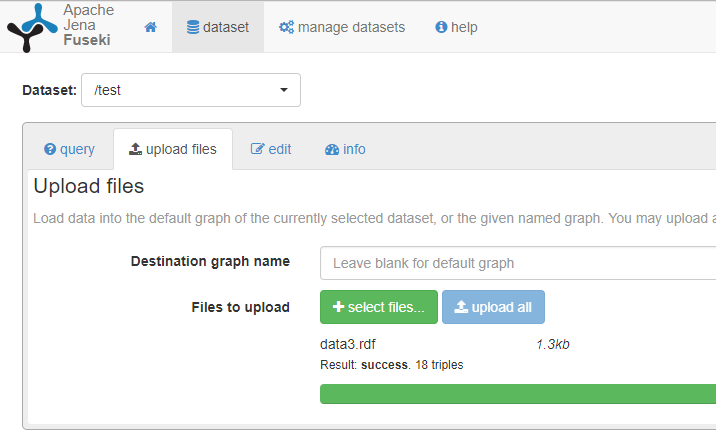

### 4.5 Optional

**查询语句**

```
PREFIX info:    <http://somewhere/peopleInfo#>
PREFIX vcard:   <http://www.w3.org/2001/vcard-rdf/3.0#>

SELECT ?name ?age
WHERE{
    ?person vcard:FN  ?name .
    OPTIONAL { ?person info:age ?age }
}
```

**结果**

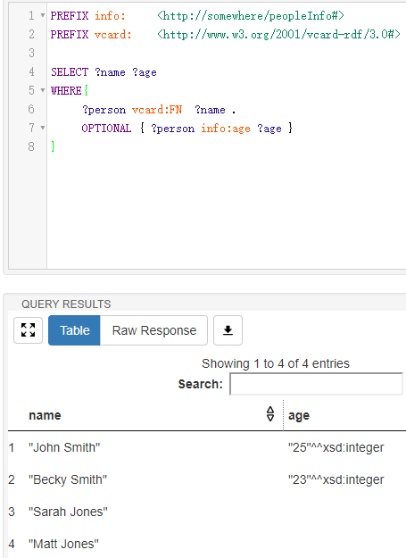

*可选语句表示可满足可不满足, 可与下面的作对比*

**查询语句**

```
PREFIX info:    <http://somewhere/peopleInfo#>
PREFIX vcard:   <http://www.w3.org/2001/vcard-rdf/3.0#>

SELECT ?name ?age
WHERE{
    ?person vcard:FN  ?name .
    ?person info:age ?age .
}
```

**结果**

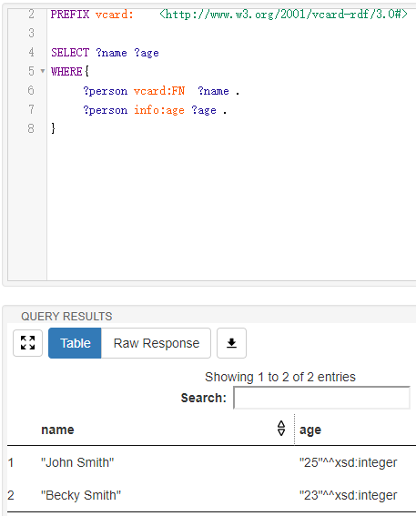

### 4.6 Option 和 Filter的组合

**查询语句**

```
PREFIX info:        <http://somewhere/peopleInfo#>
PREFIX vcard:      <http://www.w3.org/2001/vcard-rdf/3.0#>

SELECT ?name ?age
WHERE{
    ?person vcard:FN  ?name .
    OPTIONAL { ?person info:age ?age . FILTER ( ?age > 24 ) }
}
```

**结果**

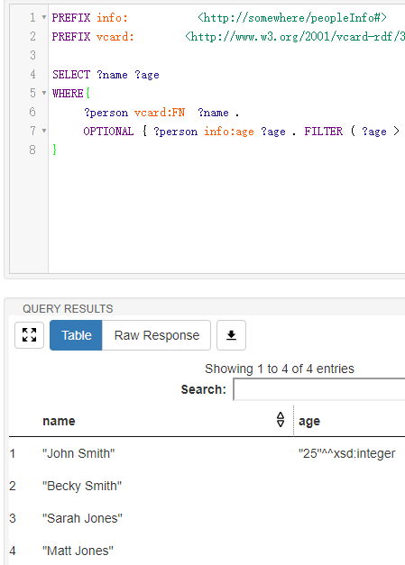

组合语句可与4.5节的两个作一下对比

**bound 包含函数**

**查询语句**

```
PREFIX info:        <http://somewhere/peopleInfo#>
PREFIX vcard:      <http://www.w3.org/2001/vcard-rdf/3.0#>

SELECT ?name ?age
WHERE{
    ?person vcard:FN  ?name .
    OPTIONAL { ?person info:age ?age . }
    FILTER ( !bound(?age) || ?age > 24 )
}
```

**结果**

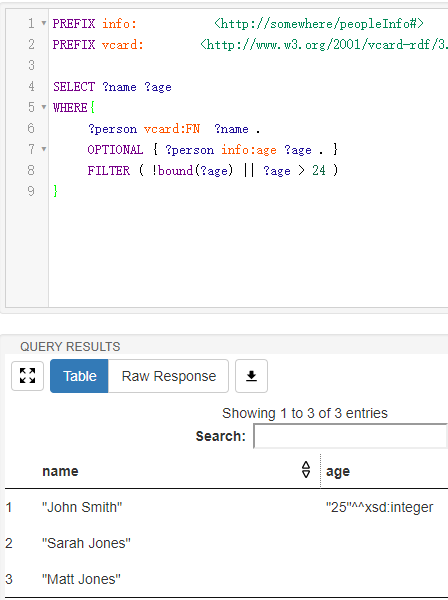

## 未完待续...
